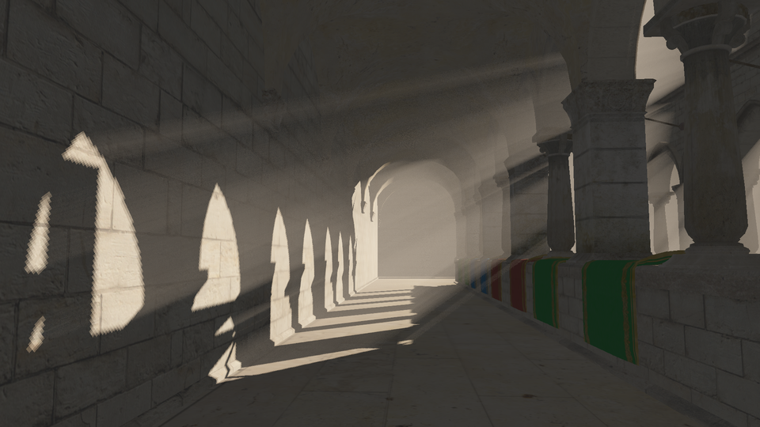

> “If you have wings, why not fly?” 
> &#8211; Nymphomaniac Vol. 1

## Introduction

This is a rewrite of [the Go code (2021)](https://github.com/aabbtree77/twinpeekz) in Nim. In turn, the Go code was a rewrite of [the C++ work by Tomas Öhberg (2017)](https://gitlab.com/tomasoh/100_procent_more_volume) which itself was a reimplementation of the research by [Balázs Tóth and Tamás Umenhoffer (EUROGRAPHICS 2009)](https://diglib.eg.org/handle/10.2312/egs.20091048.057-060).

<table align="center">
    <tr>
    <th align="center">Volumetric Lighting</th>
    </tr>
    <tr>
    <td>
    
    </td>
    </tr>
</table>

## Dependencies and Compilation

To run this code, you will need to prepare `Sponza.gltf` as indicated in [the Go code (2021)](https://github.com/aabbtree77/twinpeekz). Afterwards, adjust the absolute path and possibly file name inside this repo file `scene.nim`, lines 382, 383. Mine are the following:

```nim
const folderPath = "/home/tokyo/Sponza_GLTF2/"
const gltfFileToLoad = folderPath & "Sponza.gltf"
```

Setup Nim, git clone this repo, and run

```console
nimble install nimgl opengl glm flatty
nim c -r --hints:off -d:release main.nim 
```

See also some details below.

## Nim Setup

* Install Nim via [Choosenim](https://www.linuxhowto.net/how-to-install-nim-programming-language-on-linux/):

    ```console
    curl https://nim-lang.org/choosenim/init.sh -sSf | sh
    ...
    tokyo@tokyo-Z87-DS3H:~$ nim -v
    Nim Compiler Version 1.6.8 [Linux: amd64]
    Compiled at 2022-09-27
    Copyright (c) 2006-2021 by Andreas Rumpf

    git hash: c9f46ca8c9eeca8b5f68591b1abe14b962f80a4c
    active boot switches: -d:release
    ```

    Set the path in ".bashrc" as indicated in the command prompt.

    Consider a more specialized [text editor] which can at least highlight the Nim code.
    My choice is [NeoVim](https://github.com/nim-lang/Nim/wiki/Editor-Support) as I prefer something simple snappy lightweight. Its Nim plugin is newer than that of Vim.

* Install NeoVim:

    ```console
    sudo apt install neovim -y
    mkdir $HOME/.config/nvim
    ```

* Install [Plug](https://github.com/junegunn/vim-plug#neovim):

    ```console
    sh -c 'curl -fLo "${XDG_DATA_HOME:-$HOME/.local/share}"/nvim/site/autoload/plug.vim --create-dirs \
         https://raw.githubusercontent.com/junegunn/vim-plug/master/plug.vim'
    cd $HOME/.config/nvim
    gedit init.vim     
    ```

* Install this [NeoVim plugin](https://github.com/alaviss/nim.nvim/issues/19) 
  
    Copy-paste and save this into init.vim:
    
    ```
    call plug#begin('~/.vim/plugged')
    Plug 'alaviss/nim.nvim'
    call plug#end()  
    
    set nofoldenable
    ```
    
    Add this line to ~/.vim/plugged/nim.nvim/syntax/nim.vim:
    
    ```
    highlight link nimSugUnknown NONE
    ```
    
    in order to remove red highlights for unknown symbols, clf. [this issue](https://github.com/alaviss/nim.nvim/issues/39).
    
    Run nvim, press Esc and :PlugInstall, :q, restart nvim. Use gd and ctrl+o to jump/get back into type/function definitions.
    
* Optional: compile and run [gltfviewer](https://github.com/guzba/gltfviewer) to test it all:

    ```console
    git clone https://github.com/guzba/gltfviewer.git $HOME/gltfviewer
    cd $HOME/gltfviewer
    nimble install
    nim c -r ./src/gltfviewer.nim
    ```    

    Note [the issues](https://github.com/guzba/gltfviewer/issues), esp. [this one](https://github.com/guzba/gltfviewer/issues/8), which requires adding `windy` inside `gltfviewer/src/gltfviewer.nim`
    
    ```nim 
    import gltfviewer/gltf, gltfviewer/shaders, opengl, os, windy, strformat,
    times, vmath, strutils
    ```
    
    and inside `gltfviewer.nimble`
    
    ```nim
    requires "windy >= 0.0.0"
    ```
    
    prior to running nimble install.
    
## Random Notes Taken While Programming

* Go is better at passing user data into the GLFW callbacks. There are three ways in Go: (i) global/static variables,
(ii) [glfwgetwindowuserpointer](https://discourse.glfw.org/t/what-is-a-possible-use-of-glfwgetwindowuserpointer/1294/2), and (iii) lambda functions.
The third option is remarkably simple. Set mydata.f(...) instead of the usual f(...) as a callback. f then sees all the variables in mydata when called, meeting all the original signature requirements of f(...) as if mydata did not even exist. 

  Nim allows one to change [the scope of the functions with pragmas](https://nim-lang.org/docs/manual.html#types-procedural-type), IIAR. However, the callback functions are already defined with the "{.cdecl.}" pragma in the GLFW bindings which would not let the callbacks be turned into lambdas with "{.closure.}". So I went the global/static variable way in Nim.

* [Nim's GLTF viewer](https://github.com/guzba/gltfviewer) is a lot slower than [this surprisingly fast Go library](https://github.com/qmuntal/gltf/issues/26), if compiled with the default flags. Part of the problem here is that the Nim code reads all the images into a big intermediate Nim image sequence before uploading them into the GPU buffers. I only made this even slower by pre-extracting the mesh data on the CPU as well. In addition, there is always some "ref object" in Nim waiting to be replaced with "object". Remarkably, this problem disappears when compiling with "d:release" or "d:danger" flags. Without them, it takes about 25s. to load Sponza, with them it is as instantaneous as in the Go code. 

* GLTF spec allows 1-byte or 2-byte numbers in the GLTF buffers. In this code, everything is converted to four-byte floats and integers before uploading them to the GPU even if initially data can be of different sizes, e.g. see the function "read_vert_indices". I assumed every number is four-bytes in GLTF at first, and later fixed the bug only with Renderdoc, test cube, and the correct working example in Go.

* I missed "glGenerateMipmap(GL_TEXTURE_2D)" in the Nim code, and without it nothing seemed to work, unlike in the Go code. Debugging such OpenGL texture issues is a lot harder than debugging mesh geometry.  

* This line bypassed the Go compiler, but was caught in Nim:

    ```c
    gl.TexParameterf(gl.TEXTURE_2D, gl.TEXTURE_WRAP_S, gl.CLAMP_TO_EDGE)
    ```

    The third argument expects a float, but I am passing in an OpenGL (integer) constant here. This demanded a change to "gl.TexParameteri" in Nim. Such an error had no consequence in Go at the runtime though.

* Nim's "distinct type" adds some friction with GLenum and GLint casting. The const/let/var mutability system often produces "cannot take an address of an expression" errors. Uploading constant data to the GPU demands sending pointers/addresses and the compiler does not allow the data to be immutable.

* A tricky case of "Mat4[system.float32]" vs. "Mat4f" occurs when printing an array value in "main.nim" with "import glm" or without it. Without importing the library, the system treats the variable "WINDOW_STATE.cam.view" as type "Mat4f" which does not use the pretty printing operator $ overloaded in the package "glm". After importing "glm", the type becomes "Mat4[system.float32]" which picks up the pretty printing.

* Nim's operator overloading, generics and templates make vector/matrix math even more compact than Matlab, look at this pretty vector swizzling in glm/vec.nim:

    ```nim
    proc cross*[T](v1,v2:Vec[3,T]): Vec[3,T] =
      v1.yzx * v2.zxy - v1.zxy * v2.yzx  
    ```

    However, this compile time substitution layer is a bit scary if one recalls the C++ template errors. Consider [this Go function](https://github.com/g3n/engine/blob/b5c63e94be77871a78a9062f816b90d3af58b6c1/math32/math.go#L105):

    ```go
    func Sqrt(v float32) float32 {
	    return float32(math.Sqrt(float64(v)))
    } 
    ```

    It won't impress a type theorist, but do we really need that whole layer of problems here? If you get into "go generate" and templates [this way](https://github.com/go-gl/mathgl/blob/master/mgl32/matrix.tmpl) with the big lib mentality, then perhaps yes. Since Go version 1.18 one can use [generic types](https://planetscale.com/blog/generics-can-make-your-go-code-slower), but I would not bother.

* There is [a pointless split between "vmath" and "glm"](https://github.com/treeform/vmath/issues/42). I went with the "glm" library as this is almost a 3D vector math standard. I did not have to worry about any row-major vs column-major issues at all, though somebody did, before me...

* There are quite a few GLFW binding choices, despite a tiny community. Consider [these GLFW function signatures](https://github.com/glfw/glfw/blob/a465c1c32e0754d3de56e01c59a0fef33202f04c/src/monitor.c#L306-L326):

    ```c
    GLFWAPI GLFWmonitor** glfwGetMonitors(int* count)
    GLFWAPI GLFWmonitor* glfwGetPrimaryMonitor(void)
    ```

    Here "GLFWmonitor" is some opaque C struct hidden under platform specific layers, the "GLFWAPI" macro can be ignored. 

    Input: C semantics with __struct**__ and __struct*__.  

    What do these output types become in Go and Nim bindings?

    [Go: go-gl/glfw/v3.3](https://github.com/go-gl/glfw/blob/62640a716d485dcbf341a7c187227a4a99fb1eba/v3.3/glfw/monitor.go#L56-L83): __[]*struct__ and __*struct__.

    [Nim: treeform/staticglfw](https://github.com/treeform/staticglfw/blob/f6a40acf98466c3a11ab3f074a70d570c297f82b/src/staticglfw.nim#L429-L430): __ptr pointer__ and __pointer__.   

    [Nim: nimgl/glfw](https://github.com/nimgl/nimgl/blob/309d6ed8164ad184ed5bbb171c9f3d9d1c11ff81/src/nimgl/glfw.nim#L1740-L1767): __ptr UncheckedArray[ptr object]__ and __ptr object__. Notice the missing pointer reported in [this issue](https://github.com/nimgl/nimgl/issues/54) which then got [fixed](https://github.com/nimgl/glfw/commit/52a06d468ac8e5f6afaf92b4070973cb0fb6c58c).

    [jyapayne/nim-glfw](https://github.com/jyapayne/nim-glfw/blob/master/src/glfw/glfw_standalone.nim): __ptr ptr object__, __ptr object__ and pragma.

    [gcr/turbo-mush](https://github.com/gcr/turbo-mush/blob/0ccdfb09946fcb5c5056b3fd94dd75e00272584a/glfw.nim#L950): __ptr ptr cint__, __ptr cint__.

    They are all fine, most likely. I chose "nim/glfw" as it looked to be the most consolidating and future-proof.
    
* Let's examine the OpenGL bindings w.r.t. the OpenGL function
 
    ```c
    void glShaderSource(GLuint shader,
    GLsizei count,
    const GLchar **string,
    const GLint *length);
    ```
        
    In particular, let's focus on the third argument, i.e. ****string** which in reality is just a shader code, some ASCII text.
      
    In Go with go-gl bindings, the type becomes __**uint8__ and the conversion is achieved with a special function [gl.Strs](https://github.com/go-gl/gl/blob/726fda9656d66a68688c09275cd7b8107083bdae/v2.1/gl/conversions.go#L90), clf. [the code by Nicholas Blaskey](https://github.com/NicholasBlaskey/gophergl/blob/6459203ed630d94f155c4a1dc8d0f427cda1b3fc/Open/gl/shader.go#L18). One needs to append Go strings with "null termination", i.e. "\x00". 
    
    For the record, a similar function in [Ada](https://github.com/flyx/OpenGLAda/blob/60dc457f969216e1f814d52baaa2d4395bf00858/opengl/src/implementation/gl-files.adb), Zig: [1](https://github.com/ziglibs/zgl/blob/9fc2524bbf2e1172a5cb218eca37dc99930a31db/zgl.zig#L711), [2](https://github.com/danielabbott/Zig-Game-Engine/blob/7e26d073605e6e8de1e35234afe17b2711281835/src/WindowGraphicsInput/Shader.zig#L23), Rust: [1](https://github.com/nukep/rust-opengl-util/blob/fc30c6e386b0a4510564f242d995c845472207d3/shader.rs#L30), [2](https://github.com/Nercury/rust-and-opengl-lessons/blob/55ed79f3f93c5e66af44b0cb3afd4fa0527199ff/lesson-03/src/render_gl.rs#L107), [3](https://github.com/kooparse/fuel/blob/5d6a7396dc31feb98fa21afc7adc442ac7131522/fuel_render/src/shader.rs#L124)... Many of these Zig/Rust codes seem to ignore deallocation, but [Zig-Game-Engine](https://github.com/danielabbott/Zig-Game-Engine/blob/7e26d073605e6e8de1e35234afe17b2711281835/src/WindowGraphicsInput/Shader.zig#L23) is an exception. This is all rather [bureaucratic](https://github.com/danielabbott/Zig-Game-Engine/blob/7e26d073605e6e8de1e35234afe17b2711281835/src/RTRenderEngine/Shader.zig).

    In Nim, there are two main cases revolving around the packages "opengl" and "nimgl/opengl".

    1. **cstringArray** in the package "opengl": [gltfviewer](https://github.com/guzba/gltfviewer/blob/31ea77829426db9c43249362d9ede483a135b864/src/gltfviewer/shaders.nim#L15) uses **cstringArray** with **allocCStringArray** and **dealloc**. Jack Mott does [the same](https://github.com/jackmott/easygl/blob/9a987b48409875ffb0521f3887ae25571ff60347/src/easygl.nim#L294), but with **deallocCStringArray**, see also [Samulus-2017](https://github.com/Samulus/toycaster). [pseudo-random](https://github.com/pseudo-random/geometryutils/blob/553ff09471fd2646aad8443c9639ea7b91fca626/src/geometryutils/shader.nim#L49) and [treeform](https://github.com/treeform/shady/blob/51c59c5764b30a2c404c162caa5a7c72d50f97d6/src/shady/demo.nim#L48) skip deallocations. [Jason Beetham](https://github.com/beef331/truss3d/blob/5ca3eafcdc3d769f25a6555efc214a2bed7d0127/src/truss3D/shaders.nim#L38) gets by with casting. [Arne Döring](https://github.com/krux02/opengl-sandbox/blob/7d55a0b9368f8f1dcda7140c251e724c93af46a3/fancygl/glwrapper.nim#L888) does the same with self-hosted [bindings](https://github.com/krux02/opengl-sandbox/blob/7d55a0b9368f8f1dcda7140c251e724c93af46a3/glad/gl.nim#L1634) which have the same "glShaderSource" signature.

    2. **ptr cstring** in the package "nimgl/opengl": [Elliot Waite](https://github.com/elliotwaite/nim-opengl-tutorials-by-the-cherno/blob/cfce01842ef2bf6712747885c620c1f549454f67/ep15/shader.nim#L49) simply casts Nim's string to **cstring** and takes **addr**, without deallocations. [anon767](https://github.com/anon767/nimgl-breakout/blob/19d4b7638d26432a0daccce3433ea06f80ac3cdc/src/shader.nim#L23) does the same.      

    Having made the choice of "nimgl/glfw" previously one would be inclined to go with "nimgl/opengl", but the "opengl" case looks cleaner so you will find the latter in this code. OpenGL is initialized with **"glInit()"** in "nim/opengl", but it is the function **loadExtensions()** that does it in "opengl".
    
    Notice that **allocCStringArray** and **deallocCStringArray** are in the standard lib/system.nim module, while the correpsonding Go and Ada solutions do not exist at the language/standard lib level and are only found in the custom user-made OpenGL bindings.   

* What is the Go/Nim answer to the type __void*__? Consider this OpenGL function:

    ```c
    void glVertexAttribPointer(	
    GLuint index,
    GLint size,
    GLenum type,
    GLboolean normalized,
    GLsizei stride,
    const void * pointer);
    ```

    Go with go-gl bindings: The type becomes __unsafe.Pointer__, clf. [this file](https://raw.githubusercontent.com/go-gl/gl/master/v4.1-core/gl/package.go). [The auxiliary "PtrOffset" function](https://github.com/go-gl/gl/blob/726fda9656d66a68688c09275cd7b8107083bdae/v4.1-core/gl/conversions.go#L62) turns an integer into a required pointer with the __unsafe.Pointer(uintptr(offset)__ expression. [The Go code](https://github.com/aabbtree77/twinpeekz) sets everywhere __PtrOffset(0)__ as an argument to glVertexAttribPointer.

    Nim: The type is __pointer__, clf. [this file](https://raw.githubusercontent.com/nimgl/opengl/master/src/opengl.nim). [gltfviewer](https://github.com/guzba/gltfviewer/blob/c151dc0df66a7f9730e2f7ad4ee7170504a69864/src/gltfviewer/gltf.nim#L419) uses only __nil__ value, but the case with non-zero offsets can be found in [easygl](https://github.com/jackmott/easygl/blob/9a987b48409875ffb0521f3887ae25571ff60347/src/easygl.nim#L369), e.g. [here](https://github.com/jackmott/easygl/blob/9a987b48409875ffb0521f3887ae25571ff60347/examples/advanced_opengl/blending.nim#L111) which boils down to the expressions such as 

    ```nim
    cast[pointer](3*float32.sizeof()). 
    ```

    [Another example](https://github.com/elliotwaite/nim-opengl-tutorials-by-the-cherno/blob/cfce01842ef2bf6712747885c620c1f549454f67/ep19/vertex_array.nim#L21) (with the "nim/opengl" package instead of "opengl") emphasizes the __ByteAddress__ type instead of "int" before casting to Nim's "pointer", somewhat resembling Go's "uintptr".  

* [Nim's Case/Style Insensitivity](https://github.com/nim-lang/RFCs/issues/456). [Check this out](https://github.com/nimgl/nimgl/blob/309d6ed8164ad184ed5bbb171c9f3d9d1c11ff81/src/nimgl/glfw.nim#L857):

    ```nim
    GLFWCursorSpecial* = 0x00033001 ## Originally GLFW_CURSOR but conflicts with GLFWCursor type
    ``` 

    In the original GLFW C interface we have the GLFW_CURSOR constant and the GLFWCursor structure. In Nim these two become the same due its style rules.

    Here is another "ouch" situation in the "opengl" Nim package. Assume a perfectly normal-looking OpenGL function call somewhere in the user code:

    ```nim
    glTexImage2D(GL_TEXTURE_2D, 0, GL_RGBA16F.GLint, width.GLint, height.GLint, 0, GL_RGBA.GLenum, GL_FLOAT, nil)
    ```

    It does not compile however. The problem is that GL_FLOAT constant maps to "GLfloat* = float32" in [opengl/private/types.nim](https://github.com/nim-lang/opengl/blob/e53096f4e7f581b5c90c1912441f3059be97e0d9/src/opengl/private/types.nim#L15). A fix is to set the 8th argument to

    ```nim
    glTexImage2D(GL_TEXTURE_2D, 0, GL_RGBA16F.GLint, width.GLint, height.GLint, 0, GL_RGBA.GLenum, cGL_FLOAT, nil)
    ```

    It maps to the correct "cGL_FLOAT* = 0x1406.GLenum" constant in [opengl/private/constants.nim]. 

    This is not as bad as Go's variable capitalization though. None of this is critical.

* Multiple hopeless attempts to make OpenGL easier: [stisa-2017](https://github.com/stisa/crow), [AlxHnr-2017](https://github.com/AlxHnr/3d-opengl-demo), [floooh-2019](https://github.com/floooh/sokol-nim/issues/5), [jackmott-2019](https://github.com/jackmott/easygl), [krux02-2020](https://github.com/krux02/opengl-sandbox), [liquidev-2021](https://github.com/liquidev/aglet), [treeform-2022](https://github.com/treeform/shady)...

* An ldd check on the final Ubuntu compiled binaries in Go and Nim:

    Go:
    ```console
    tokyo@tokyo-Z87-DS3H:~/twinpeekz$ ldd twinpeekz
    linux-vdso.so.1 (0x00007ffc9cd9c000)
    libGL.so.1 => /lib/x86_64-linux-gnu/libGL.so.1 (0x00007f8ea74a3000)
    libX11.so.6 => /lib/x86_64-linux-gnu/libX11.so.6 (0x00007f8ea7363000)
    libm.so.6 => /lib/x86_64-linux-gnu/libm.so.6 (0x00007f8ea727c000)
    libc.so.6 => /lib/x86_64-linux-gnu/libc.so.6 (0x00007f8ea7054000)
    libGLdispatch.so.0 => /lib/x86_64-linux-gnu/libGLdispatch.so.0 (0x00007f8ea6f9c000)
    libGLX.so.0 => /lib/x86_64-linux-gnu/libGLX.so.0 (0x00007f8ea6f66000)
    libxcb.so.1 => /lib/x86_64-linux-gnu/libxcb.so.1 (0x00007f8ea6f3c000)
    /lib64/ld-linux-x86-64.so.2 (0x00007f8ea7543000)
    libXau.so.6 => /lib/x86_64-linux-gnu/libXau.so.6 (0x00007f8ea6f36000)
    libXdmcp.so.6 => /lib/x86_64-linux-gnu/libXdmcp.so.6 (0x00007f8ea6f2e000)
    libbsd.so.0 => /lib/x86_64-linux-gnu/libbsd.so.0 (0x00007f8ea6f16000)
    libmd.so.0 => /lib/x86_64-linux-gnu/libmd.so.0 (0x00007f8ea6f07000)
    ``` 

    Nim:
    ```console
    tokyo@tokyo-Z87-DS3H:~/twinpeekz2$ ldd main
    linux-vdso.so.1 (0x00007fff13588000)
    libm.so.6 => /lib/x86_64-linux-gnu/libm.so.6 (0x00007f5e74d60000)
    libc.so.6 => /lib/x86_64-linux-gnu/libc.so.6 (0x00007f5e74b38000)
    /lib64/ld-linux-x86-64.so.2 (0x00007f5e7505d000)
    ```

    Where has my libGL gone? The sizes of the binaries: 4.7MB (Go: default), 2.0MB (Nim: default), 1.1MB (Nim: d:release), 977KB (Nim: d:danger). 
    
    It turns out that there are calls to C function "dlopen" at the runtime by Nim and the bindings. The libs loaded by "dlopen" are not known to
    ldd, lddtree, objdump, readelf which catch only what gets loaded at the pre-start of the program. Reading ["/proc/PID/maps"](https://www.baeldung.com/linux/show-shared-libraries-executables) does show the additional dependencies. Here is a more compact output of [lsof](https://unix.stackexchange.com/questions/120015/how-to-find-out-the-dynamic-libraries-executables-loads-when-run) command (strace did not work, but this [SO](https://unix.stackexchange.com/questions/226524/what-system-call-is-used-to-load-libraries-in-linux/462710#462710) might shed some light):
    
    ```console
    tokyo@tokyo-Z87-DS3H:~/twinpeekz2$ pidof main
    15466
    tokyo@tokyo-Z87-DS3H:~/twinpeekz2$ lsof -p 15466|grep mem
    lsof: WARNING: can't stat() tracefs file system /sys/kernel/debug/tracing
          Output information may be incomplete.
    main    15466 tokyo  DEL    REG                0,1             7232 /memfd:/.glXXXXXX
    main    15466 tokyo  mem    CHR            195,255              939 /dev/nvidiactl
    main    15466 tokyo  mem    REG                8,3 32099568 6819477 /usr/lib/x86_64-linux-gnu/libnvidia-glcore.so.470.141.03
    main    15466 tokyo  mem    REG                8,3    18456 6819487 /usr/lib/x86_64-linux-gnu/libnvidia-tls.so.470.141.03
    main    15466 tokyo  DEL    REG                0,1             1025 /memfd:/.nvidia_drv.XXXXXX
    main    15466 tokyo  mem    REG                8,3   639848 6819479 /usr/lib/x86_64-linux-gnu/libnvidia-glsi.so.470.141.03
    main    15466 tokyo  mem    REG                8,3   112856 6823495 /usr/lib/x86_64-linux-gnu/libxcb-glx.so.0.0.0
    main    15466 tokyo  mem    REG                8,3  1289616 6819471 /usr/lib/x86_64-linux-gnu/libGLX_nvidia.so.470.141.03
    main    15466 tokyo  mem    REG                8,3    84584 6822362 /usr/lib/x86_64-linux-gnu/libdrm.so.2.4.0
    main    15466 tokyo  mem    REG                8,3    14664 6823186 /usr/lib/x86_64-linux-gnu/librt.so.1
    main    15466 tokyo  mem    REG                8,3    21448 6823130 /usr/lib/x86_64-linux-gnu/libpthread.so.0
    main    15466 tokyo  mem    REG                8,3    14432 6822352 /usr/lib/x86_64-linux-gnu/libdl.so.2
    main    15466 tokyo  mem    REG                8,3    14048 6821909 /usr/lib/x86_64-linux-gnu/libX11-xcb.so.1.0.0
    main    15466 tokyo  mem    REG                8,3    18736 6821938 /usr/lib/x86_64-linux-gnu/libXinerama.so.1.0.0
    main    15466 tokyo  mem    REG                8,3    30912 6821930 /usr/lib/x86_64-linux-gnu/libXfixes.so.3.1.0
    main    15466 tokyo  mem    REG                8,3    43488 6821922 /usr/lib/x86_64-linux-gnu/libXcursor.so.1.0.2
    main    15466 tokyo  mem    REG                8,3    47728 6821948 /usr/lib/x86_64-linux-gnu/libXrender.so.1.3.0
    main    15466 tokyo  mem    REG                8,3    47504 6821946 /usr/lib/x86_64-linux-gnu/libXrandr.so.2.2.0
    main    15466 tokyo  mem    REG                8,3    76320 6821936 /usr/lib/x86_64-linux-gnu/libXi.so.6.1.0
    main    15466 tokyo  mem    REG                8,3    81640 6821928 /usr/lib/x86_64-linux-gnu/libXext.so.6.4.0
    main    15466 tokyo  mem    REG                8,3    22872 6821964 /usr/lib/x86_64-linux-gnu/libXxf86vm.so.1.0.0
    main    15466 tokyo  mem    REG                8,3 17167584 6821170 /usr/lib/locale/locale-archive
    main    15466 tokyo  mem    REG                8,3    47472 6822872 /usr/lib/x86_64-linux-gnu/libmd.so.0.0.5
    main    15466 tokyo  mem    REG                8,3    89096 6822206 /usr/lib/x86_64-linux-gnu/libbsd.so.0.11.5
    main    15466 tokyo  mem    REG                8,3    26800 6821926 /usr/lib/x86_64-linux-gnu/libXdmcp.so.6.0.0
    main    15466 tokyo  mem    REG                8,3    18720 6821915 /usr/lib/x86_64-linux-gnu/libXau.so.6.0.0
    main    15466 tokyo  mem    REG                8,3   166504 6823527 /usr/lib/x86_64-linux-gnu/libxcb.so.1.1.0
    main    15466 tokyo  mem    REG                8,3  1306280 6821911 /usr/lib/x86_64-linux-gnu/libX11.so.6.4.0
    main    15466 tokyo  mem    REG                8,3   141896 6821888 /usr/lib/x86_64-linux-gnu/libGLX.so.0.0.0
    main    15466 tokyo  mem    REG                8,3   715200 6821893 /usr/lib/x86_64-linux-gnu/libGLdispatch.so.0.0.0
    main    15466 tokyo  mem    REG                8,3   543056 6821882 /usr/lib/x86_64-linux-gnu/libGL.so.1.7.0
    main    15466 tokyo  mem    REG                8,3  2216304 6822210 /usr/lib/x86_64-linux-gnu/libc.so.6
    main    15466 tokyo  mem    REG                8,3   940560 6822861 /usr/lib/x86_64-linux-gnu/libm.so.6
    main    15466 tokyo  mem    CHR              195,0              940 /dev/nvidia0
    main    15466 tokyo  mem    REG                8,3   240936 6821873 /usr/lib/x86_64-linux-gnu/ld-linux-x86-64.so.2
    ```
  
    A small binary does not mean much here as there are a lot of dynamic system dependencies. A few more useful links: the command "ldconfig -p" and [linker vs runtime 
    loader](https://stackoverflow.com/questions/46224750/building-a-shared-object-library-ldd-does-not-show-specified-name).

* White Space. Nim/Python white spaces make the code fragile in double loops where one needs to be extra careful not to push the last lines of the inner loop into the outter space, esp. when the "tabs" are only two-spaced, when the loops are long, when editing/rewriting takes place later. "gofmt" with "vim-go" is faster to type and more reliable.

* Naked imports are not a problem at all with Nim, paradoxically. You get into definitions with the right tools instantly (I use [alaviss/nim.nvim](https://github.com/alaviss/nim.nvim)), and the code becomes readable and terse without those package namespaces. 

* Nim's "include" makes the compiler barf about duplication while "import" is demanding w.r.t. the manual markings of visibility. Function definition order within a file matters. Go made me think less about these matters.

* Go saved a lot of time as the GLTF library to load meshes both to CPU and GPU already pre-existed, but I would no longer push Go in 3D. Go is a new Erlang.

* cloc and [clocrt](https://github.com/michalspano/clocrt):

  | Language | files | blank | comment | code |
  | :------: | :---: | :---: | :-----: | :--: |
  | Nim      | 8     | 468   | 157     | 1368 |
  | GLSL     | 7     | 107   | 89      | 261  |
  | Markdown | 1     | 95    | 0       | 235  |
  | SUM:     | 16    | 670   | 246     | 1864 |

* Programming desktop 3D revolves around some big libs which become rather language-agnostic: GLFW/SDL, GLTF/Assimp, MGL vector math, stb_image, ImGui, OpenGL...

<div align="center">
  
</div>

* Minor Update (2025). Is there a better C?

    Nim has beautiful syntax and a very rich set of features, see ["Nim Nuggets: Systems Programming & Metaprogramming Magic" by Aditya Siram](https://www.youtube.com/watch?v=d2VRuZo2pdA&t=15s&ab_channel=StrangeLoopConference). Like Ada, it has that hint of gradual complexity, where, unlike in Rust or C++, you don't need to know everything before coding anything. 

    At the same time, Nim also misses simple constructs like type C = A or B and there is an ongoing issue of fitting sum types: [2024](https://github.com/nim-lang/RFCs/issues/548), [2025](https://github.com/nim-lang/RFCs/issues/559)... This is very annoying, may be even a disaster. It is OK if you still live in the year 2010 and are content with classical OO, but in 2025 we have already seen better systems (Zig, Rust, Odin) which can do the A or B thing. Inheritance with dispatch is clunkier, and even Go with its interfaces feels very inferior now. Is this decisive? I do not know.
    
    [object vs ref object](https://github.com/nim-lang/Nim/blob/devel/compiler/ast.nim) is a simple way to do memory management without the zoo of (smart) pointers, life times, arenas, but a ref object can easily kill the performance. So we get that control of what goes to the stack or heap, annotate the code, but in the end might get only the GC performance with some kind of determinism as a booby prize. Still, I like a lot this model, it introduces a "check your ref object" game where you gradually complicate memory management based on suspect areas without the need to clutter your mind upfront.
    
    So the answer is not clear. I would also recommend Odin as a better C. It is likely the only mature modern low level language which is not an oil tanker, see [Languages I considered using before Odin by Rickard Andersson](https://www.youtube.com/watch?v=vFFcCLzOOyw&t=3333s&ab_channel=RickardAndersson%28gonz%29). A lot of inspiration from Pascal and Go there. [V](https://github.com/vlang/v), [Hare](https://harelang.org/), [Oberon+](https://oberon-lang.github.io/) also follow this minimalist philosophy, but they are not there yet. The low level language field also starts to be so crowded that learning a new one seems like a waste of time, unfortunately.
    
    Nim is fine in my book. It can even be better C/Pascal than Odin. I fear the latter forces everyone into allocators prematurely, like Zig. Also, Odin/Zig's errors as values are good on paper, but we have seen what they do to Go and Rust, with paranoid error checking and manual propagation in every function, which does not guarantee anything, and you still have to know what panics, deal with different error subtypes across libraries, unknown errors, unreachable errors somewhere in the middleware. Irrationally, it is also not fun to read or write the code of Pascal, Ada, Go, Zig, Rust, Odin. The languages feel like tools to "get shit done", you know what they are, you can sense their robustness. Nim is different. It can feel like scripting, it invites you to study/polish things, which can also be a good or bad thing. Esp. bad with teams and software engineering I suspect.
    
    Ultimately, Odin's unions, minimalism, and the allocator model vs Nim's beauty, gradual complexity, and the lack of proper unions. Ideally, Odin for work, and Nim for hobby projects.
